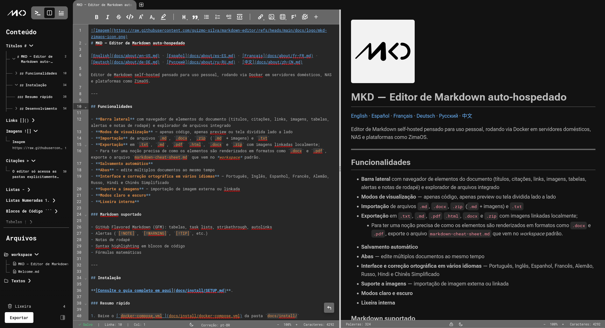

# MKD — Éditeur Markdown auto-hébergé

Éditeur Markdown self-hosted conçu pour un usage personnel, fonctionnant via Docker sur des serveurs domestiques, NAS et plateformes comme ZimaOS.

---


## Fonctionnalités

- **Barre latérale** avec navigateur d'éléments du document (titres, citations, liens, images, tableaux, alertes et notes de bas de page) et explorateur de fichiers intégré
- **Modes d'affichage** — code uniquement, aperçu uniquement ou vue fractionnée côte à côte
- **Importation** de fichiers `.md`, `.docx`, `.zip` (`.md` + images) et `.txt`
- **Exportation** en `.txt`, `.md`, `.pdf`, `.html`, `.docx` et `.zip` avec images liées localement ;
  - Pour avoir une idée précise du rendu des éléments dans des formats comme `.docx` et `.pdf`, exportez le fichier `markdown-cheat-sheet.md` inclus dans le *workspace* par défaut.
- **Sauvegarde automatique**
- **Onglets** — éditez plusieurs documents simultanément
- **Interface et correcteur orthographique en plusieurs langues** — Portugais, Anglais, Espagnol, Français, Allemand, Russe, Hindi et Chinois Simplifié
- **Prise en charge des images** — importation d'images externes ou liées
- **Modes clair et sombre**
- **Corbeille interne**

### Markdown pris en charge

- GitHub Flavored Markdown (GFM) : tableaux, listes de tâches, texte barré, liens automatiques
- Alertes (`[!NOTE]`, `[!WARNING]`, `[!TIP]`, etc.)
- Notes de bas de page
- Coloration syntaxique dans les blocs de code
- Formules mathématiques

---

## Installation

Consultez le guide complet dans **[docs/install/SETUP.fr-FR.md](../install/SETUP.fr-FR.md)**.

### Démarrage rapide

1. Téléchargez le [`docker-compose.yml`](../install/docker-compose.yml) depuis le dossier `docs/install/`
1. Configurez les volumes avec les dossiers auxquels vous souhaitez accéder
1. Démarrez les conteneurs :

```bash
docker compose up -d
```

1. Ouvrez <http://localhost:3010> dans votre navigateur

> L'éditeur n'accède qu'aux dossiers explicitement configurés dans `docker-compose.yml` — aucun accès arbitraire au système de fichiers du serveur.

---

## Développement

### Prérequis

| Outil | Version minimale |
| --- | --- |
| Node.js | 20+ |
| npm | 10+ |
| Docker | 20.10+ (pour la production) |

### Dépendances principales

#### Frontend

- [Next.js 16](https://nextjs.org/) + React 19 + TypeScript
- [Tailwind CSS](https://tailwindcss.com/)
- [CodeMirror 6](https://codemirror.net/) — cœur de l'éditeur
- [react-markdown](https://github.com/remarkjs/react-markdown) + plugins remark/rehype — rendu de l'aperçu
- [react-i18next](https://react.i18next.com/) — internationalisation
- [nspell](https://github.com/wooorm/nspell) — correcteur orthographique avec dictionnaires Hunspell

#### Backend

- [Express](https://expressjs.com/) + TypeScript
- [multer](https://github.com/expressjs/multer) — téléversement d'images
- [archiver](https://github.com/archiverjs/node-archiver) — exportation en ZIP

### Exécution en local

**Backend :**

```bash
cd backend
npm install
npm run dev
```

**Frontend** (dans un autre terminal) :

```bash
cd frontend
npm install
npm run dev
```

- Frontend : <http://localhost:3000>
- API : <http://localhost:3001>

### Structure du projet

```text
markdown-editor/
├── frontend/
│   ├── app/                # Routes et mise en page (Next.js App Router)
│   ├── components/         # Composants React
│   │   ├── Editor/         # Éditeur CodeMirror
│   │   ├── Preview/        # Rendu de l'aperçu
│   │   ├── Toolbar/        # Barre d'outils
│   │   ├── Sidebar/        # Barre latérale des assets
│   │   ├── Tabs/           # Système d'onglets
│   │   └── FileBrowser/    # Explorateur de fichiers
│   ├── hooks/
│   ├── locales/            # Traductions (JSON par langue)
│   └── utils/
│
├── backend/
│   └── src/
│       ├── routes/
│       ├── controllers/
│       ├── services/
│       ├── middleware/
│       └── utils/
│
└── docker/
    ├── Dockerfile.frontend
    └── Dockerfile.backend
```

---

##### Ce programme vous a été utile ? Offrez-moi un café ! 😉

<a href='https://ko-fi.com/M4M41W6IPV' target='_blank'></a>
